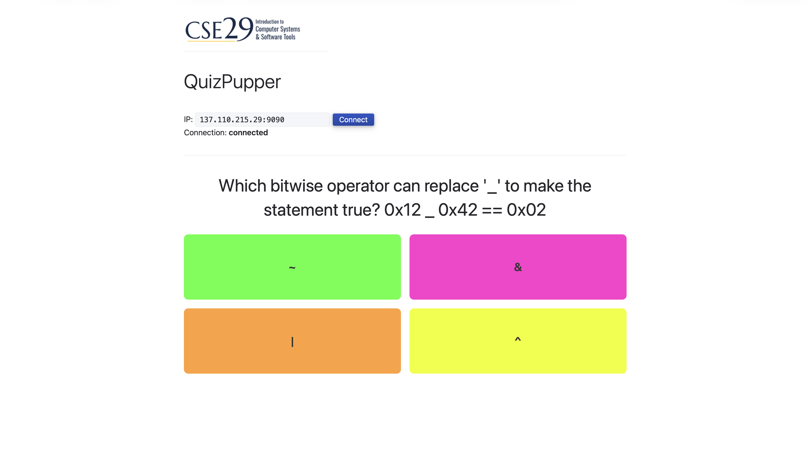

# quizpupper_server

This webpage is meant to be used in conjunction with QuizPupper. It allows the user to specify a WebSocket address to connect to the Pupper and receive String messages for quiz questions and answers on the `/quiz_question` topic. It also supports publishing messages on the `/quiz_response` topic. For connectivity it uses the [RosBridge Suite](https://github.com/robotwebtools/rosbridge_suite) of packages.

## UI example

